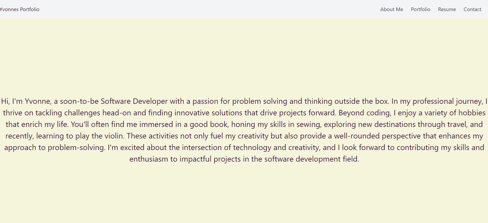
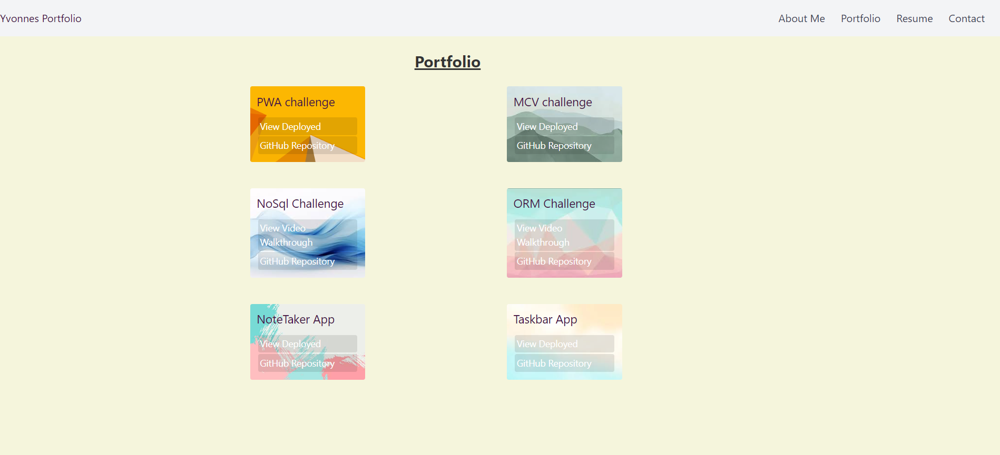
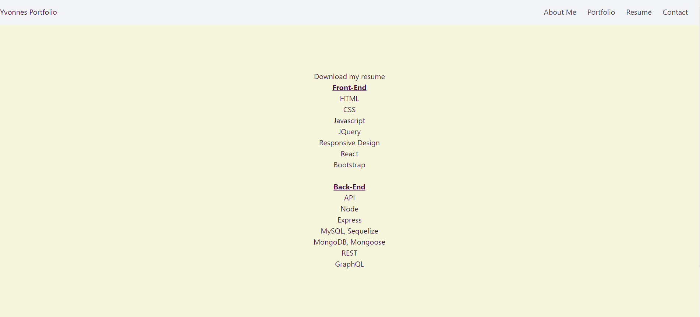
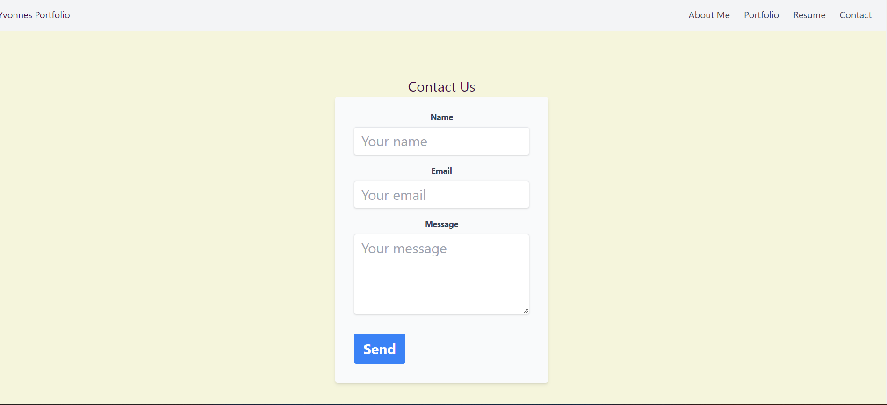

## React Portfolio

## Description
This is my personal portfolio built using React, showcasing various projects I've worked on. It includes sections such as About Me, Portfolio, Contact, and Resume, each serving a specific purpose to highlight my skills and experiences as a web developer.

## Table of Contents

- [Demo](#demo)
- [Features](#features)
- [Technologies Used](#technologies-used)
- [Installation](#installation)
- [Usage](#usage)
- [Screenshots](#screenshots)
- [Contributing](#contributing)
- [License](#license)
- [Contact](#contact)

## Features
Navigation: A single header component with navigation links (About Me, Portfolio, Contact, Resume), using react-router-dom for seamless navigation within the app.

Portfolio Section: Displays projects with titles, deployed application links, and GitHub repository links.

Contact Form: Simple form validation for name, email, and message fields.

Resume Section: Includes a link to download your resume and lists your technical proficiencies.

Footer: Contains links to your GitHub, LinkedIn, any  other platform i chose Stack Overflow.

## Technologies Used
React
React Router DOM
HTML/CSS
Bootstrap (or another CSS framework for styling)
Netlify (for deployment)

## Installation
Clone the repository:

bash
Copy code
git clone https://github.com/yourusername/react-portfolio.git
Navigate into the project directory:

bash
Copy code
cd react-portfolio
Install dependencies:

Copy code
npm install
Usage
To run the application locally:

sql
Copy code
npm start
Open http://localhost:3000 to view it in the browser.

## Screenshots

## Live site

https://peaceful-souffle-259ab0.netlify.app 

## License
 MIT License 

## Contact

GitHub: [Your GitHub Profile](https://github.com/yvonneewa)

## references
xpert, activities from class, google